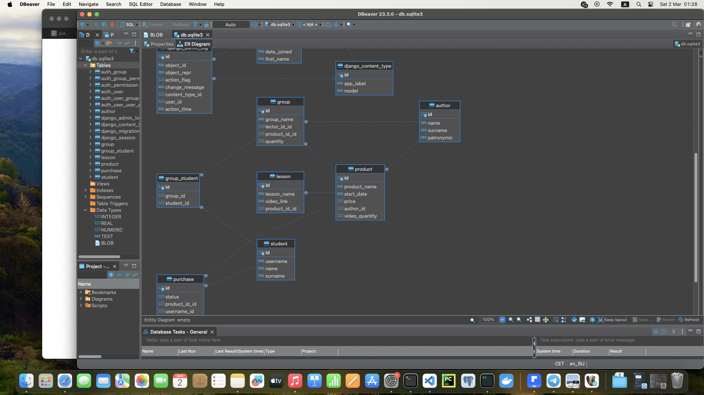

  

  
  
  
  
  

## Онлайн-школа
Реализация backend-части веб-приложения для небольшой онлайн-школы

## Архитектура приложения

  

## Ключевые особенности
- добавление информации об авторах, продуктах, студентах производится через django админ-панель
- перед распределением студента в группу реализованы проверки наличия учебного продукта, студента в базе, статуса оплаты
- проверка статуса оплаты идет в последнюю очередь. Если запись существует, то это значит, что студент уже был распрелелен в группу. Возвращается сообщение об этом
- если записи об оплате нет, то создается новая со статусом "оплачено" по умолчанию. Работа БД реализована таким образом для упрощения демонстрации работы приложения
- после последней проверки идет выбор группы. Для просмотра механизма заполнения групп максимальное число обучающихся составляет 2 человека
- студент добавляется в группу по своему профилю с наибольшим количеством людей, но меньше установленного максимального значения
- если групп не существует или свободных мест нет, то автоматически создаются новые три
- реализовано API, которое возвращает информацию в JSON формате обо всех возможных учебных продуках. Также данное API возвращает информацию по спискам всех видео, доступных каждому пользователю в зависимости от статуса оплаты. 

## Как использовать
- склонировать данный репозиторий
- создать суперпользователя
- запустить приложение командой python manage.py runserver
- зайти в админ-панель и приступить к добавлению информации в определенной последовательности
- добавить авторов продуктов
- добавить продукты
- добавить студентов
- добавить уроки по каждому продукту
- перейти на стартовую страницу http://127.0.0.1:8000/
- добавить студентов в группы; через админ-панель отслеживать создание и заполняемость групп
- по ссылкам можно посмотреть на работу API

## В будущем
Добавить реализацию установки статуса оплаты после проведения "тестового" платежа через платежную систему Stripe. Пример реализации в репозитории django_stripe_app.

